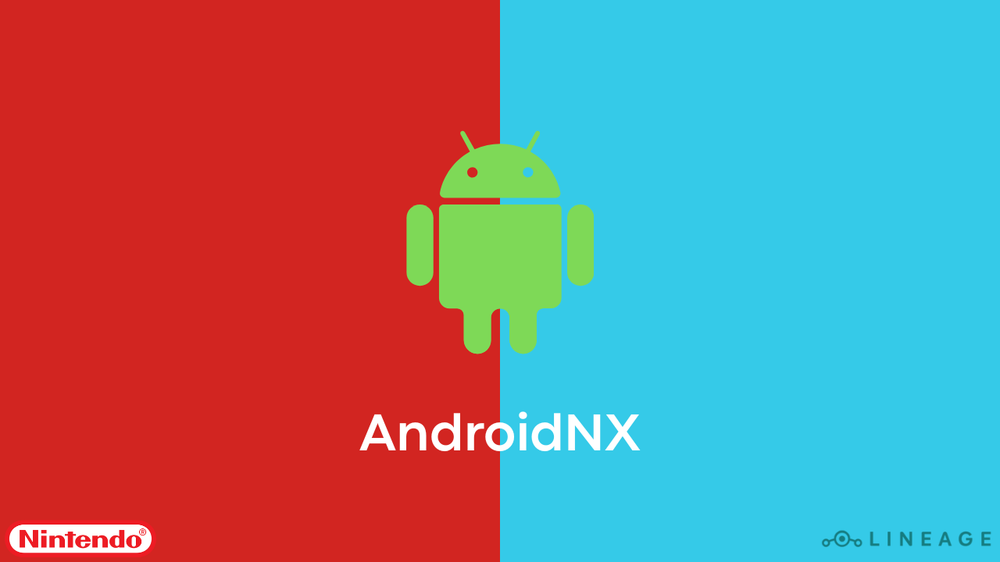

# AndroidNX - Android 15 para Nintendo Switch

AndroidNX é um pacote all-in-one para Nintendo Switch, baseado no bootloader Hekate/Nyx e no projeto Switchroot Android 15. O objetivo é facilitar a instalação e o uso do Android 15 no seu Nintendo Switch, sem incluir arquivos que habilitem pirataria.

Este pacote inclui:
- Bootloader Hekate/Nyx
- Imagens e arquivos necessários para o Switchroot Android 15
- NikGapps para Android 15
- Scripts e recursos para facilitar a inicialização do Android no Switch

## **[FAÇA O DOWNLOAD POR AQUI!](https://github.com/Danil0Ws/AndroidNX/releases/latest)**

## Guia de Instalação do Switchroot Android 15

### 1. Preparação do microSD
- Faça backup de todos os dados importantes do seu cartão microSD.
- Formate o microSD em FAT32 (recomendado usar o utilitário guiformat no Windows ou o Utilitário de Disco no macOS).

### 2. Copiando os arquivos
- Baixe o pacote mais recente do AndroidNX.
- Extraia todo o conteúdo do arquivo `.zip` diretamente na raiz do microSD.

### 3. Instalando o bootloader e arquivos do Android
- Certifique-se de que os arquivos do Hekate/Nyx e as imagens do Android estejam nas pastas corretas (`/switchroot/android/`, `/bootloader/`, etc.).
- O arquivo `boot.scr` e as imagens `.img` devem estar conforme a estrutura do pacote.

### 4. Inicializando o Switchroot Android
- Insira o microSD no Nintendo Switch.
- Inicie o console em modo RCM e envie o payload do Hekate usando TegraRcmGUI, NXLoader ou outro método de sua preferência.
- No menu do Hekate, selecione a opção para inicializar o Android (`Launch -> Android` ou similar).

### 5. Configuração inicial do Android
- Aguarde o primeiro boot, que pode demorar alguns minutos.
- Siga as instruções na tela para configurar o Android 15 normalmente.
- Faça login na sua conta Google se desejar utilizar os apps do NikGapps.

### 6. Dicas e recomendações
- Para melhor desempenho, utilize cartões microSD de alta velocidade (UHS-I ou superior).
- Sempre faça backup dos seus dados antes de atualizar ou reinstalar o Android.
- Consulte a [wiki do Switchroot](https://switchroot.org/) para dicas avançadas, troubleshooting e compatibilidade de apps.

## Aviso legal
Este pacote não contém arquivos que habilitam pirataria. Todo o crédito pertence aos respectivos desenvolvedores dos projetos originais. Se algum proprietário solicitar a remoção de arquivos, eles serão removidos imediatamente.

- O AndroidNX não habilita pirataria e seu propósito é permitir o uso do Android no Nintendo Switch.
- O uso para outros fins é de responsabilidade do usuário e pode ser proibido pela legislação local.
- Não comercializamos, distribuímos ou incentivamos o uso de backups ilegais, ROMs ou qualquer conteúdo que infrinja direitos autorais.

## Agradecimentos especiais
- [Switchroot](https://switchroot.org/) pela configuração para Nintendo Switch.
- [Lineage](https://lineageos.org/) pela imagem do Android para Nintendo Switch.
- [NikGapps](https://github.com/CTCaer/hekate/) pelo gapps para o Android.
- [CTCaer](https://github.com/CTCaer/hekate/) pelo Hekate e Nyx.
- Todos os desenvolvedores que contribuem para a cena homebrew do Switch.

## 📝 Licença

O nome Nintendo Switch e o logo são marcas registradas da [Nintendo](https://github.com/Nintendo). Este repositório não é afiliado à Nintendo ou a qualquer um de seus parceiros.

Switchroot Android é um projeto independente, todos os créditos aos desenvolvedores originais.
